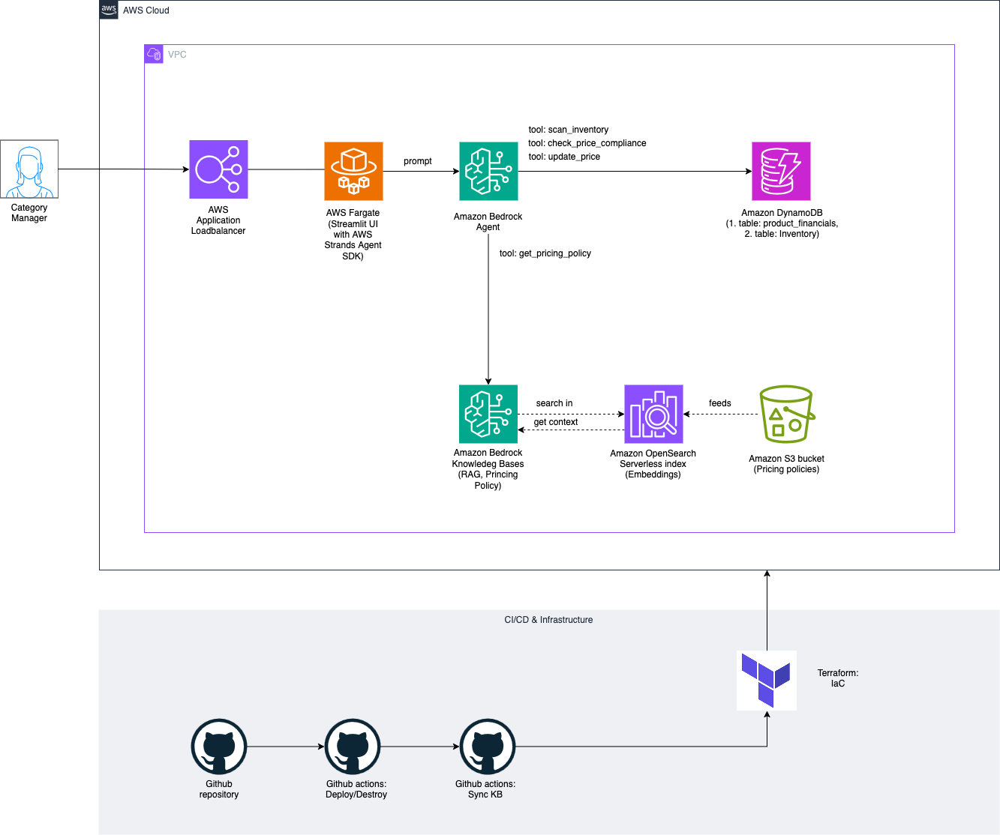
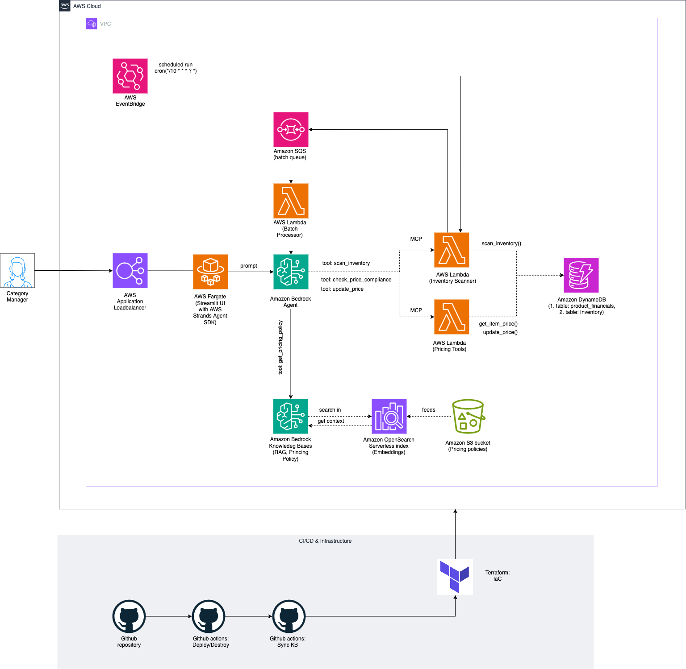

# Pricing Agent

A pricing compliance agent built with Strands Agents SDK and Streamlit.

## Overview

This application helps ensure products are priced correctly according to company policies and regulations. It uses the Strands Agents SDK to create an AI agent powered by Claude that can:

- Check if product prices comply with pricing policies
- Scan inventory for pricing issues
- Update product prices
- Explain pricing policies to users using the knowledge base

## Architecture

### Current Implementation (Stage 1)



Our current implementation focuses on simplicity and core functionality:

- **Streamlit UI with Strands Agent**: A single container running both the UI and agent
- **Direct Tool Integration**: Tools are implemented as Python functions with the `@tool` decorator
- **Knowledge Base**: Bedrock Knowledge Base with OpenSearch for policy retrieval
- **Data Storage**: DynamoDB tables for pricing rules and inventory data

This architecture provides a clean, maintainable implementation that delivers the core functionality while minimizing infrastructure complexity.

### Target Architecture (Future)



The target architecture adds scalability for handling large inventories:

- **Batch Processing**: EventBridge for scheduled runs, SQS for batch queues
- **Separate Lambda Functions**: Dedicated functions for inventory scanning and pricing tools
- **Same Knowledge Base**: Maintains the same knowledge base architecture
- **Same Data Storage**: Continues using DynamoDB for data persistence

This architecture will be implemented incrementally as inventory size grows and requires more scalable processing.

### CI/CD Pipeline

<!-- CI/CD Pipeline diagram will be added soon -->

Our deployment process is fully automated:

- **GitHub Repository**: Source code and policy documents
- **GitHub Actions**: Automated workflows for deployment, destruction, and KB syncing
- **Terraform**: Infrastructure as Code for all AWS resources

## Repository Structure

```
pricing-agent/
│
├── app/                        # Application code
│   ├── __init__.py
│   ├── agent.py                # Strands agent definition
│   ├── tools/                  # Custom pricing tools
│   │   ├── __init__.py
│   │   ├── pricing.py
│   │   └── inventory.py
│   ├── app.py                  # Streamlit UI
│   └── requirements.txt        # Python dependencies
│
├── docs/                       # Documentation
│   └── images/                 # Architecture diagrams
│
├── infrastructure/             # Terraform infrastructure
│   ├── main.tf
│   ├── variables.tf
│   ├── outputs.tf
│   ├── vpc.tf
│   ├── ecs.tf
│   ├── alb.tf
│   ├── s3.tf
│   ├── dynamodb.tf
│   ├── iam.tf
│   ├── bedrock.tf
│   └── backend.tf
│
├── policies/                   # Policy documents (KB source)
│   ├── general/
│   │   └── general_pricing_policy.txt
│   ├── electronics/
│   │   └── electronics_pricing_policy.txt
│   └── clothing/
│       └── clothing_pricing_policy.txt
│
├── scripts/
│   └── sync_kb.py              # Script to sync KB with policies
│
└── .github/
    └── workflows/
        ├── deploy.yml          # Main deployment workflow
        ├── destroy.yml         # Cleanup workflow
        └── sync_kb.yml         # KB sync workflow
```

## Deployment

The application is deployed using GitHub Actions CI/CD pipeline:

1. **Set up GitHub Secrets**:
   - `AWS_ACCESS_KEY_ID`: AWS access key with appropriate permissions
   - `AWS_SECRET_ACCESS_KEY`: Corresponding AWS secret key
   - `AWS_REGION`: AWS region for deployment (e.g., `us-east-1`)
   - `ENVIRONMENT`: Deployment environment (e.g., `dev`, `staging`, `prod`)

2. **Trigger Deployment**:
   - Push to the main branch, or
   - Manually trigger the workflow from GitHub Actions tab

3. **Access the Application**:
   - The application URL will be available in the Terraform outputs
   - This can be found in the GitHub Actions logs or AWS Console

## Knowledge Base Management

Pricing policies are stored in the `policies/` directory. To update policies:

1. Edit the policy files in the appropriate subdirectory
2. Commit and push changes to the repository
3. The GitHub Actions workflow will automatically sync the changes to the knowledge base

## Interactive Diagrams

For interactive diagrams, you can open the original .drawio files in the docs directory using [draw.io](https://app.diagrams.net/).

## License

[MIT License](LICENSE)
